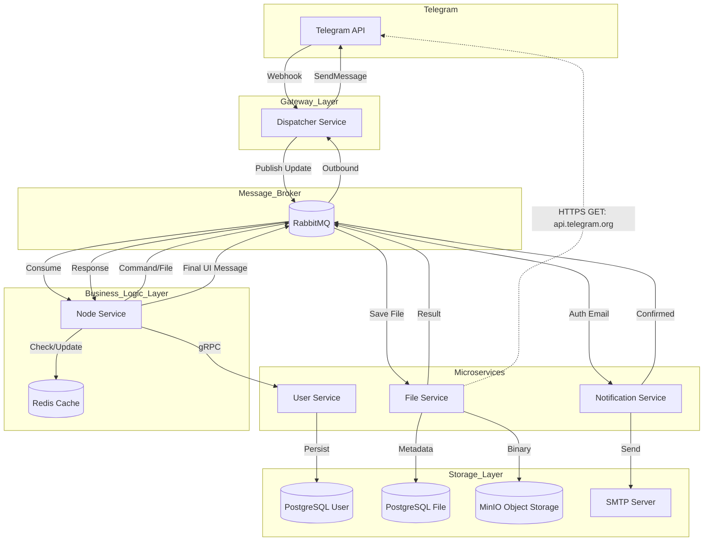

# Архитектурное описание проекта

## Общее назначение
Проект представляет собой распределённую систему в виде набора микросервисов, реализующих Telegram-бота для загрузки, хранения и шаринга пользовательских файлов.

Основные возможности:
- регистрация пользователей через Telegram с подтверждением email;
- загрузка файлов через Telegram;
- хранение файлов в объектном хранилище;
- генерация ссылок для скачивания и шаринга;
- асинхронная, событийно-ориентированная обработка всех пользовательских действий.

Проект спроектирован с упором на:
- разделение ответственности между сервисами;
- асинхронное взаимодействие через брокер сообщений;
- масштабируемость и отказоустойчивость;
- приближение к архитектуре production-систем.

---

## Архитектурный стиль

- **Microservices Architecture** — каждый сервис решает строго ограниченную задачу.
- **Event-driven architecture** — взаимодействие сервисов осуществляется через события в RabbitMQ.
- **Async-first** — отсутствуют синхронные HTTP-вызовы между сервисами (за исключением gRPC для user lookup).
- **CQRS на уровне взаимодействия** — команды и события передаются через брокер, состояния хранятся локально в сервисах.

---

## Высокоуровневая схема

---

## Структура репозитория

- `dispatcher-service`
- `node-service`
- `user-service`
- `file-service`
- `notification-service`
- `common`

Каждый сервис:
- независим в сборке и запуске;
- имеет собственную конфигурацию;
- может масштабироваться отдельно.

---

## Описание сервисов

### Dispatcher Service

**Ответственность:**
- точка входа для Telegram Webhook;
- приём `Update` от Telegram;
- классификация апдейтов (текст, файл, фото и т.д.);
- преобразование Telegram-объектов в внутренние DTO;
- публикация событий в RabbitMQ;
- получение ответных событий и отправка сообщений обратно в Telegram.

**Ключевые особенности:**
- не содержит бизнес-логики;
- работает как gateway и router;
- полностью stateless.

---

### Node Service (Core Orchestrator)

**Ответственность:**
- центральный обработчик бизнес-сценариев;
- потребление событий от Dispatcher;
- идентификация пользователя;
- интерпретация команд пользователя;
- координация взаимодействия между сервисами;
- формирование ответных событий для пользователя.

**Взаимодействие:**
- Redis — кэш пользователей;
- gRPC → User Service — получение или регистрация пользователя;
- RabbitMQ — публикация и потребление доменных событий.

Node Service сознательно реализует роль **orchestrator**, а не smart-gateway.

---

### User Service

**Ответственность:**
- хранение и управление пользователями;
- регистрация новых пользователей;
- подтверждение email;
- управление статусом пользователя (guest / registered).

**Технологии:**
- PostgreSQL — основное хранилище;
- gRPC — синхронный API для Node Service;
- RabbitMQ — публикация доменных событий (например, `UserRegistered`).

User Service является **source of truth** для пользовательских данных.

---

### Notification Service

**Ответственность:**
- обработка событий, связанных с уведомлениями;
- формирование и отправка email;
- генерация ссылок подтверждения регистрации.

**Особенности:**
- не знает о Telegram;
- реагирует исключительно на события;
- легко расширяется под другие каналы уведомлений.

---

### File Service

**Ответственность:**
- загрузка файлов с серверов Telegram;
- сохранение файлов в объектное хранилище MinIO;
- хранение метаданных файлов;
- генерация ссылок для скачивания.

**Технологии:**
- PostgreSQL — метаданные файлов;
- MinIO — бинарное хранилище;
- RabbitMQ — асинхронное взаимодействие.

File Service изолирует работу с файловой системой и внешними API.

---

### Common Library

**Назначение:**
- общие DTO;
- контракты событий;
- enum'ы и базовые модели;
- shared exceptions.

Используется как зависимость во всех сервисах для:
- согласованности контрактов;
- минимизации дублирования кода;
- упрощения эволюции событийной модели.

---

## Взаимодействие и сценарии

### Регистрация пользователя
1. Пользователь отправляет сообщение боту.
2. Dispatcher публикует событие.
3. Node Service:
   - ищет пользователя в Redis;
   - при отсутствии делает gRPC-вызов в User Service.
4. Пользователь получает статус `guest`.
5. При попытке загрузки файла Node предлагает регистрацию.
6. Email отправляется через Notification Service.
7. Пользователь подтверждает email.
8. User Service обновляет статус и публикует событие.
9. Node Service обновляет Redis-кэш.

---

### Загрузка файла
1. Пользователь отправляет файл в Telegram.
2. Dispatcher → RabbitMQ.
3. Node Service проверяет статус пользователя.
4. Node публикует событие загрузки файла.
5. File Service:
   - загружает файл с Telegram;
   - сохраняет в MinIO;
   - пишет метаданные в PostgreSQL;
   - публикует событие с ссылкой.
6. Node формирует ответ.
7. Dispatcher отправляет ссылку пользователю.

---

## Хранилища данных

| Сервис | Хранилище | Назначение |
|------|----------|------------|
| Node Service | Redis | Кэш пользователей |
| User Service | PostgreSQL | Пользователи |
| File Service | PostgreSQL | Метаданные файлов |
| File Service | MinIO | Файлы |

---

## Причины архитектурных решений

- **RabbitMQ** — явная асинхронность, контроль потоков, слабая связность.
- **Redis** — быстрый доступ к пользовательскому контексту.
- **gRPC** — строгий контракт и высокая производительность для user lookup.
- **MinIO** — S3-совместимое хранилище, близкое к production.
- **Multi-module repo** — удобство локальной разработки и демонстрации архитектуры.

---

## Цели проекта

- продемонстрировать понимание backend-архитектуры;
- показать работу с брокерами сообщений;
- продемонстрировать real-world паттерны (orchestrator, event-driven, caching);

